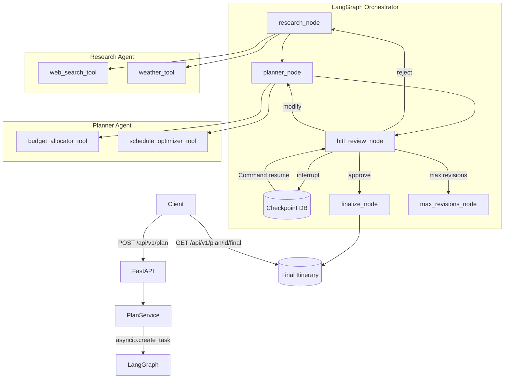
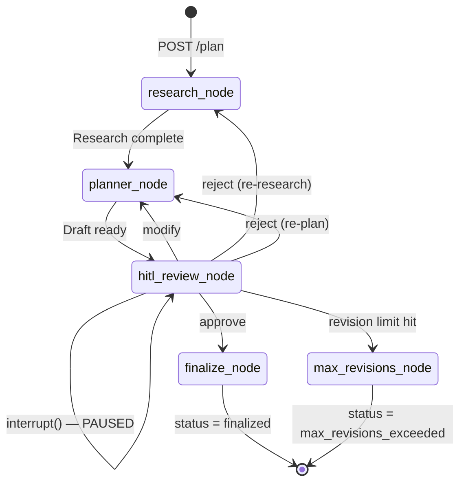

# AI Travel Planner

A multi-agent AI travel planning system built with **LangGraph** and **FastAPI**, featuring genuine **Human-in-the-Loop (HITL)** approval workflows with persistent state checkpointing.

> **Take-Home Assignment Submission** — AI/ML Engineer Position

---

## Project Overview

This system accepts a travel request (destination, dates, budget, interests) and orchestrates two specialized AI agents — a Research Agent and an Itinerary Planner Agent — through a LangGraph state machine. Execution pauses at a genuine HITL gate where a human can approve, reject, or request modifications via REST API. All state is persisted to a database checkpointer, enabling the workflow to resume exactly where it paused.

---

## Assignment Requirements Addressed

| Requirement | Implementation |
|---|---|
| Multi-agent orchestration | LangGraph `StateGraph` with Research + Planner agents |
| Genuine HITL | `interrupt()` inside `hitl_review_node` — graph physically suspends |
| State persistence | `AsyncSqliteSaver` (dev) / `AsyncPostgresSaver` (prod) |
| Structured LLM output | `with_structured_output(DraftItinerary, include_raw=True)` + retry loop |
| Tool use | 4 LangChain `@tool` functions (web search, weather, budget allocator, schedule optimizer) |
| Error handling | Typed exception hierarchy, graceful degradation on all external API failures |
| Async execution | Background `asyncio.create_task()` — HTTP endpoints never block on LLM calls |
| Testing | 97 automated tests (unit + integration + E2E) |

---

## Architecture



---

## LangGraph Workflow



---

## Human-in-the-Loop Design

### How HITL Works

**Where execution pauses:** Inside `hitl_review_node`, the LangGraph native `interrupt()` function is called. This is not a simulated pause — LangGraph physically saves the full graph state to the checkpointer database and suspends the coroutine.

```python
# hitl_review_node.py — genuine interrupt
review_decision = interrupt({
    "message": "Draft ready for review.",
    "status": "awaiting_review",
    "draft_itinerary": draft_itinerary.model_dump(),
})
# ← Execution halts here. Nothing below runs until Command(resume=...) arrives.
```

**How `plan_id` / `thread_id` works:** The UUID returned by `POST /plan` is used directly as the LangGraph `thread_id`. There is no secondary mapping table. All subsequent API calls use this single identity:

```python
config = {"configurable": {"thread_id": plan_id}}
```

**How state persists:** The compiled graph is bound to a checkpointer at startup (`AsyncSqliteSaver` in dev). Every time `astream()` progresses through a node, LangGraph writes a checkpoint. The checkpoint survives server restarts.

**How resumption works:** `POST /plan/{id}/review` calls `graph.ainvoke(Command(resume=review_payload), config=config)`. This resumes execution from the exact line after `interrupt()` — the return value of `interrupt()` becomes `review_payload`. No new graph thread is created.

---

## Agent Design

### Research Agent (`app/agents/research_agent.py`)

A **ReAct-style agent** that uses an LLM (GPT-4o-mini) with bound tools to gather destination intelligence:
- Searches for attractions, safety info, local tips, seasonal notes
- Fetches real-time weather summaries via OpenWeatherMap
- Produces a structured `ResearchOutput` Pydantic model
- Tool loop runs up to 8 iterations before forcing structured extraction

### Planner Agent (`app/agents/planner_agent.py`)

A **structured-output agent** that generates a complete day-by-day itinerary:
- Uses `with_structured_output(DraftItinerary, include_raw=True)` to enforce schema
- Retry loop (up to 3 attempts) feeds parse errors back to the LLM for self-correction
- Calls budget allocator and schedule optimizer tools during planning
- Accepts `revision_count`, `rejection_feedback`, and `modification_request` for revision cycles
- Stamps `version` on every generated itinerary

---

## Tools

| Tool | File | Type | Description |
|---|---|---|---|
| `web_search_tool` | `app/tools/web_search.py` | External API (Serper) | Fetches real-time travel information from the web. 10s timeout, graceful degradation on failure. |
| `weather_tool` | `app/tools/weather.py` | External API (OpenWeatherMap) | Retrieves current weather and humidity for destination. 8s timeout, non-fatal on error. |
| `budget_allocator_tool` | `app/tools/budget_allocator.py` | Pure computation | Distributes budget across accommodation, transport, food, activities, contingency using destination cost-of-living heuristics. No external API. |
| `schedule_optimizer_tool` | `app/tools/schedule_optimizer.py` | Pure computation | Reorders activities by time-slot preferences, fatigue management, and logical flow rules. No external API. |

---

## Project Structure

```
ai-travel-planner/
├── app/
│   ├── agents/
│   │   ├── research_agent.py       # ReAct research agent
│   │   ├── planner_agent.py        # Structured-output planner agent
│   │   └── itinerary_agent.py      # Supporting agent logic
│   ├── api/
│   │   └── routes/plans.py         # FastAPI route handlers (thin HTTP layer)
│   ├── core/
│   │   ├── config.py               # Pydantic Settings, env-var loading
│   │   ├── checkpointer.py         # Checkpointer factory (SQLite/Postgres)
│   │   ├── exceptions.py           # Typed exception hierarchy
│   │   └── logging.py              # Structured logging + sanitizing filter
│   ├── graph/
│   │   ├── graph.py                # StateGraph assembly and compilation
│   │   ├── state.py                # TravelPlanState TypedDict + STATUS constants
│   │   ├── edges/routing.py        # Conditional edge routing logic
│   │   └── nodes/
│   │       ├── research_node.py    # Calls Research Agent
│   │       ├── planner_node.py     # Calls Planner Agent
│   │       ├── hitl_review_node.py # interrupt() — HITL gate
│   │       ├── finalize_node.py    # Stamps final itinerary
│   │       └── max_revisions_node.py # Revision limit guard
│   ├── models/
│   │   ├── domain.py               # TravelRequest, ResearchOutput, DraftItinerary, etc.
│   │   ├── requests.py             # CreatePlanRequest, ReviewRequest
│   │   └── responses.py            # PlanStatusResponse, FinalPlanResponse
│   ├── prompts/
│   │   ├── research_agent.py       # Research agent system prompt
│   │   └── planner_agent.py        # Planner agent system prompt
│   ├── services/
│   │   ├── planning_service.py     # PlanningService — orchestrates graph + repo
│   │   └── plan_repository.py      # In-memory metadata store (plan_id → status)
│   ├── tools/
│   │   ├── web_search.py
│   │   ├── weather.py
│   │   ├── budget_allocator.py
│   │   └── schedule_optimizer.py
│   └── main.py                     # FastAPI app, lifespan, middleware
├── tests/
│   ├── conftest.py                 # Shared fixtures, mock graph setup
│   ├── integration/
│   │   ├── test_api.py             # Full workflow API integration tests
│   │   ├── test_e2e_qa.py          # Edge case and validation QA tests
│   │   └── test_graph.py           # LangGraph node integration tests
│   └── unit/
│       ├── test_models.py
│       ├── test_tools.py
│       ├── test_routing.py
│       ├── test_research_agent.py
│       ├── test_itinerary_agent.py
│       └── test_logging_sanitizer.py
├── scripts/
│   └── smoke_test.py               # Local E2E verification script
├── .env.example
├── requirements.txt
├── pyproject.toml
├── Dockerfile
└── docker-compose.yml
```

---

## Setup Instructions

### Prerequisites

- Python 3.11+
- API keys: OpenAI, Serper, OpenWeatherMap

### 1. Clone and Install

```bash
git clone https://github.com/vaibhavii2810/AI-Travel-Planner-Demo-.git
cd AI-Travel-Planner-Demo-
python -m venv venv
# Windows:
venv\Scripts\activate
# macOS/Linux:
source venv/bin/activate
pip install -r requirements.txt
```

### 2. Configure Environment

```bash
cp .env.example .env
```

Edit `.env` with your credentials.

### 3. Run Locally

```bash
uvicorn app.main:app --reload --port 8000
```

The SQLite checkpointer (`dev_checkpoint.db`) is created automatically on first startup.

> **Local Demo Without API Keys:** If `OPENAI_API_KEY` is set to the placeholder value `sk-...`, the server automatically patches the agents with fast mock implementations. The entire Create → Review → Approve → Finalize flow completes in under 2 seconds via the Swagger UI.

---

## Environment Variables

| Variable | Required | Description |
|---|---|---|
| `OPENAI_API_KEY` | Yes | OpenAI API key for LLM agents |
| `SERPER_API_KEY` | Yes | Serper.dev key for web search tool |
| `WEATHER_API_KEY` | Yes | OpenWeatherMap key for weather tool |
| `ENV` | No | `dev` (default) or `production` |
| `DATABASE_URL` | Prod only | PostgreSQL URL for persistent checkpointer |
| `CORS_ORIGINS` | No | Comma-separated allowed origins (default: `localhost`) |
| `GRAPH_RECURSION_LIMIT` | No | Max LangGraph recursion steps (default: `50`) |
| `MAX_REVISIONS` | No | Max HITL revision cycles (default: `5`) |
| `LOG_LEVEL` | No | Logging level (default: `INFO`) |

---

## Running the Application

```bash
# Development (SQLite checkpointer, auto-reload)
uvicorn app.main:app --reload --port 8000

# Production (set ENV=production and DATABASE_URL in environment)
uvicorn app.main:app --host 0.0.0.0 --port 8000 --workers 1

# Docker
docker-compose up --build

# Run tests
pytest

# Run E2E smoke test (server must be running)
python scripts/smoke_test.py
```

---

## API Documentation

Interactive docs: **http://127.0.0.1:8000/docs**

### `POST /api/v1/plan`
Submit a new travel planning request.

- **Validates** input via Pydantic
- **Generates** a unique `plan_id` (UUID)
- **Starts** LangGraph execution as a background task
- **Returns** `201 Created` immediately — does not block on LLM generation

### `GET /api/v1/plan/{plan_id}`
Poll for workflow status and draft itinerary.

- Returns plan status, revision count, draft itinerary (when ready)
- **404** if plan not found
- Status values: `researching` → `planning` → `awaiting_review` → `revising` → `finalized` / `error`

### `POST /api/v1/plan/{plan_id}/review`
Submit a HITL review decision. Only valid when status is `awaiting_review`.

| Action | Required Fields | Effect |
|---|---|---|
| `approve` | none | Resumes graph → `finalize_node` → `finalized` |
| `reject` | `feedback` (non-empty) | Resumes graph → re-research or re-plan |
| `modify` | `modifications` (dict) | Resumes graph → `planner_node` with targeted changes |

- **409 Conflict** if plan is not in `awaiting_review` state

### `GET /api/v1/plan/{plan_id}/final`
Retrieve the finalized itinerary. Only available after approval.

- **409 Conflict** if plan is not yet finalized (use this to poll during finalization)
- **404** if plan not found

### `GET /api/v1/health`
Health check with checkpointer type and environment info.

---

## Example Requests and Responses

### Create a Plan

```bash
curl -X POST http://localhost:8000/api/v1/plan \
  -H "Content-Type: application/json" \
  -d '{
    "destination": "Kyoto, Japan",
    "start_date": "2025-10-10",
    "end_date": "2025-10-15",
    "budget_min": 2000,
    "budget_max": 3500,
    "budget_currency": "USD",
    "interests": ["temples", "food", "culture"],
    "num_travelers": 2
  }'
```

**Response** `201 Created`:
```json
{
  "plan_id": "f7a9cbb7-5e88-416f-91a0-db6a62a7aaed",
  "status": "researching",
  "message": "Your travel plan for Kyoto, Japan is being created."
}
```

### Poll for Draft

```bash
curl http://localhost:8000/api/v1/plan/f7a9cbb7-5e88-416f-91a0-db6a62a7aaed
```

**Response when ready** `200 OK`:
```json
{
  "plan_id": "f7a9cbb7-5e88-416f-91a0-db6a62a7aaed",
  "status": "awaiting_review",
  "revision_count": 1,
  "draft_itinerary": { "version": 1, "daily_plans": [...] }
}
```

### Approve the Plan

```bash
curl -X POST http://localhost:8000/api/v1/plan/f7a9cbb7-5e88-416f-91a0-db6a62a7aaed/review \
  -H "Content-Type: application/json" \
  -d '{"action": "approve"}'
```

### Reject with Feedback

```bash
curl -X POST http://localhost:8000/api/v1/plan/f7a9cbb7-5e88-416f-91a0-db6a62a7aaed/review \
  -H "Content-Type: application/json" \
  -d '{"action": "reject", "feedback": "Too many temples. Add more food experiences."}'
```

### Modify Specific Details

```bash
curl -X POST http://localhost:8000/api/v1/plan/f7a9cbb7-5e88-416f-91a0-db6a62a7aaed/review \
  -H "Content-Type: application/json" \
  -d '{"action": "modify", "modifications": {"day_3": "Replace afternoon museum with cooking class"}}'
```

### Retrieve Final Itinerary

```bash
curl http://localhost:8000/api/v1/plan/f7a9cbb7-5e88-416f-91a0-db6a62a7aaed/final
```

---

## Testing

### Test Strategy

| Layer | File | Description |
|---|---|---|
| Unit | `tests/unit/test_models.py` | Pydantic validation, field constraints, cross-field validators |
| Unit | `tests/unit/test_tools.py` | Tool functions with mocked HTTP calls |
| Unit | `tests/unit/test_routing.py` | Conditional edge routing logic |
| Unit | `tests/unit/test_research_agent.py` | Research agent structured output extraction |
| Unit | `tests/unit/test_logging_sanitizer.py` | API key scrubbing from log output |
| Integration | `tests/integration/test_api.py` | Full HTTP workflow (create → poll → review → final) |
| Integration | `tests/integration/test_e2e_qa.py` | Edge cases: invalid inputs, 409 conflicts, 404s |
| Integration | `tests/integration/test_graph.py` | LangGraph node behavior with `MemorySaver` |

All tests use `MemorySaver` and mock the LLM agents — no real API calls are made.

### Run Tests

```bash
# Run all 97 tests
pytest

# With verbose output
pytest -v

# Run a specific test file
pytest tests/integration/test_api.py

# Live E2E test against running server
python scripts/smoke_test.py
```

**Current result:** 97 passed, 0 failed.

---

## Design Decisions

### Why LangGraph?
LangGraph provides a proper state machine abstraction with built-in checkpoint persistence and genuine `interrupt()` support. The alternative — managing workflow state manually in FastAPI — would require significant custom infrastructure to achieve the same HITL correctness guarantees.

### Why Persistent Checkpointer?
Without a checkpointer, `interrupt()` has no backend and cannot actually suspend execution. The checkpointer is the source of truth for all graph state. This also enables crash recovery — if the server restarts mid-planning, the workflow state is not lost.

### Why `plan_id == thread_id`?
A single identity eliminates a mapping layer. The UUID returned on plan creation is used directly as the LangGraph thread identity for all subsequent checkpoint reads and graph resumptions. Simpler, less error-prone.

### Why Pydantic Structured Output?
Using `with_structured_output(DraftItinerary, include_raw=True)` ensures the LLM produces a validated, typed object rather than a freeform string. The `include_raw=True` flag exposes parsing errors so the retry loop can feed correction prompts back to the LLM instead of crashing.

### Why Deterministic Tools for Budget and Schedule?
Budget allocation and schedule optimization are deterministic problems — given the same inputs, they should produce the same outputs. Implementing these as pure Python functions (not LLM calls) eliminates hallucination risk, reduces latency, and lowers API costs. The LLM focuses on creative planning; tools enforce constraints.

---

## Error Handling

| Exception | HTTP Status | Trigger |
|---|---|---|
| `PlanNotFoundError` | 404 | `plan_id` does not exist |
| `InvalidStateError` | 409 | Review submitted when not in `awaiting_review` |
| `PlanNotFinalizedError` | 409 | `/final` called before approval completes |
| `MaxRevisionsError` | 422 | Revision count exceeds configured limit |
| `LLMOutputParseError` | 500 | Structured output fails after all retries |
| `GraphExecutionError` | 500 | Unexpected error during LangGraph execution |
| `CheckpointerError` | 503 | Database connection failure |

All exceptions map to typed `TravelPlannerError` subclasses with `error_code` and `message` fields. Stack traces never leak to the HTTP response.

---

## Assumptions

1. The frontend polls `GET /plan/{id}` to track status — no WebSocket push is required.
2. A single user owns a plan — no multi-tenant access control in this take-home scope.
3. `plan_id` is treated as a bearer credential for the plan — no JWT required.
4. LLM responses are in English; no i18n handling is implemented.
5. SQLite is acceptable for local development and single-instance deployments.

---

## Tradeoffs

| Decision | Tradeoff |
|---|---|
| `asyncio.create_task()` for graph execution | Simple, but task dies if the server process restarts mid-run. Production needs a durable task queue. |
| In-memory `PlanRepository` | Fast reads, zero infrastructure. Lost on restart. Needs a persistent DB table for production. |
| SQLite checkpointer | Works for single-instance local dev. Not safe for multi-worker deployments. |
| No authentication | Acceptable for a take-home. Production needs OAuth2/JWT with plan ownership tied to user identity. |
| Synchronous tool HTTP calls | LangGraph runs tool calls in threads. Acceptable for low concurrency; production would use async HTTP. |

---

## Production Considerations

### What Would Change for Day-1 Production

**Checkpointer Backend**
Replace `AsyncSqliteSaver` with `AsyncPostgresSaver`. Set `DATABASE_URL` in environment. LangGraph handles the schema migration.

**Distributed Task Execution**
Move `asyncio.create_task()` to **Celery + Redis** or **Temporal**. The API queues the job; workers execute the graph. This decouples the web server from long-running LLM tasks and survives server restarts.

**Authentication & Authorization**
Implement **OAuth2 with JWT**. Bind `plan_id` ownership to `user_id` in the plan metadata table. Verify ownership before exposing draft itineraries or accepting review decisions.

**Rate Limiting & Cost Controls**
Add **Redis-backed rate limiting** (`slowapi`) at the API gateway — e.g., 5 plan requests per user per day. Add LangChain token usage callbacks to enforce hard cost caps per request.

**Observability**
- Set `LANGCHAIN_TRACING_V2=true` for **LangSmith** tracing of every LLM call and tool invocation.
- Export FastAPI metrics to **Prometheus/Grafana**.
- Structured JSON log shipping to **Datadog** or **CloudWatch**.

**Semantic Caching**
Cache research results by destination + date range using **Redis + embeddings**. Identical or semantically similar destination requests reuse cached research, avoiding duplicate Serper and OpenAI calls.

**Secrets Management**
Move API keys from `.env` to **AWS Secrets Manager** or **HashiCorp Vault**. Rotate keys without redeployment.

**Idempotency**
Generate idempotency keys on `POST /plan` to prevent duplicate submissions from network retries creating multiple plan records.

---

## What I Would Improve With More Time

1. **Streaming responses** — Stream `GET /plan/{id}` status updates via Server-Sent Events instead of polling.
2. **Smarter rejection routing** — Use an LLM classifier (not just keyword matching) to decide whether a rejection requires full re-research or only re-planning.
3. **Async tool calls** — Convert Serper and OpenWeatherMap calls to `httpx.AsyncClient` to avoid thread pool usage in the agent loop.
4. **Plan metadata persistence** — Migrate `PlanRepository` from in-memory dict to a proper async SQLAlchemy table so metadata survives server restarts.
5. **Multi-destination support** — Extend `TravelRequest` to support trip segments across multiple cities.
6. **Cost estimation accuracy** — Replace the heuristic budget allocator with real accommodation pricing data from an external API.

---

## Known Limitations

- **No authentication** — Any client with a `plan_id` can submit a review decision.
- **In-memory plan metadata** — Plan records (not graph checkpoints) are lost on server restart.
- **Single-worker only** — SQLite checkpointer is not safe for concurrent multi-worker Uvicorn deployments.
- **Keyword-based rejection routing** — `route_after_review` uses string matching on feedback to decide between re-research and re-plan. An LLM classifier would be more reliable.
- **Mock agents in dev** — When placeholder API keys are detected, agents are replaced with deterministic mocks for local testing. No real LLM calls are made in this mode.

---

## License

This project is submitted as a take-home assignment and is intended for evaluation purposes only.
