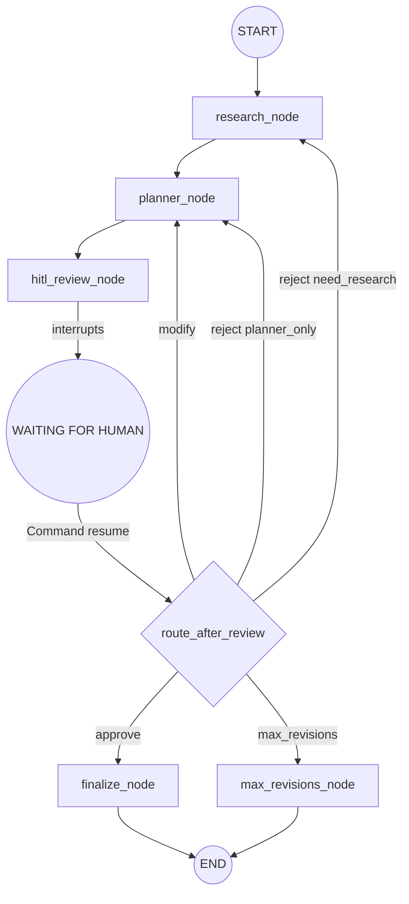

# AI Travel Planner - Agent Architecture and Design Decisions

This document captures the architectural analysis, design decisions, and implementation strategies for the AI Travel Planner multi-agent system, as discussed by the AI Architect.

## Core Design Principles

1.  **`plan_id` = `thread_id` (Single Identity)**
    The UUID returned by `POST /plan` **is** the LangGraph `thread_id`. No mapping table. No secondary IDs. Every subsequent operation (`GET`, `POST /review`, `GET /final`) uses it directly to access graph state.

2.  **Genuine HITL via `interrupt()` + `Command(resume=...)`**
    The `hitl_review_node` calls LangGraph's native `interrupt()` — the graph **physically stops** and the checkpoint is saved to the database. When `POST /plan/{id}/review` is called, the service layer calls `graph.ainvoke(Command(resume=review_decision), config=config)`. This resumes from the exact line after `interrupt()` — no FastAPI if/else simulation.

3.  **Checkpointer for Persistence**
    The checkpointer is the absolute source of truth.
    *   Test: `MemorySaver`
    *   Dev: `SqliteSaver`
    *   Prod: `AsyncPostgresSaver`
    *   *Note: LangGraph version pinned (`langgraph~=1.2.9`) to guarantee API compatibility.*
    The `setup()` call runs in the FastAPI lifespan to ensure tables exist before any request.

4.  **Background Execution for Long-Running Tasks**
    LLM + API calls can take 30–60s. The graph runs in a `BackgroundTask` so `POST /plan` returns immediately. Clients poll `GET /plan/{id}` to read state. A thin `PlanRepository` metadata store handles instant responses before the graph even starts.
    *   *Note: Post-stream checkpoint verification runs `aget_state(config)` immediately after the `astream()` finishes to verify whether the workflow has correctly entered the HITL pause (`hitl_review_node`) or reached final completion.*

## High-Risk Areas and Bypass Strategies

1.  **Risk: Simulated HITL instead of Genuine HITL**
    *   **Bypass:** Enforce `checkpointer` at compile time (fail-fast). Use the canonical `interrupt()` pattern inside the `hitl_review_node`. The return value of `interrupt()` must be the `Command(resume=...)` payload.

2.  **Risk: Checkpointer Setup and Migration Failures**
    *   **Bypass:** Use an ENV-gated checkpointer factory. Run `await saver.setup()` during the FastAPI `lifespan` context manager. This ensures tables exist before requests arrive and connection pools are closed gracefully.

3.  **Risk: Background Execution and State Consistency**
    *   **Bypass:** Write a metadata record (`PlanMeta`) to a lightweight store (`PlanRepository`) *before* launching the background graph task. `GET /plan/{id}` reads this metadata first, ensuring an instant response even if the LangGraph checkpoint hasn't been created yet. Update the `status` field in `TravelPlanState` at the start of every node. 
    *   *Correction implemented:* Nodes write `STATUS_RESEARCHING`, `STATUS_PLANNING`, or `STATUS_REVISING` explicitly inside the graph state which is streamed and synchronized back to the repository.

4.  **Risk: Infinite Revision Loop**
    *   **Bypass:** Implement a `MAX_REVISIONS` guard in the conditional routing edge (`route_after_review`), *before* dispatching to any agent. Use a dedicated `max_revisions_node` to cleanly terminate the graph if the limit is reached, rather than throwing an unhandled exception.

5.  **Risk: Structured LLM Output Schema Instability**
    *   **Bypass:** Design forgiving schemas (`extra="ignore"`, coersion validators). Use `include_raw=True` with `with_structured_output` and implement a retry loop that feeds parsing errors back to the LLM for self-correction. All UTC timestamp representations are strictly timezone-aware (`datetime.now(timezone.utc)`) to avoid Python 3.12+ deprecation issues.

## Graph Topology



## Folder Structure

```
ai-travel-planner/
├── app/
│   ├── api/                 # Thin FastAPI routes
│   │   ├── dependencies.py
│   │   └── routes/plans.py
│   ├── models/              # Pydantic schemas
│   │   ├── domain.py
│   │   ├── requests.py
│   │   └── responses.py
│   ├── services/            # Business logic
│   │   ├── planning_service.py
│   │   └── plan_repository.py
│   ├── graph/               # LangGraph Orchestration
│   │   ├── graph.py
│   │   ├── state.py
│   │   ├── nodes/
│   │   └── edges/
│   ├── agents/              # LangChain Agents
│   ├── tools/               # External tools
│   ├── core/                # Config, Exceptions, Checkpointer
│   └── prompts/             # System and Human prompts
├── scripts/
│   └── smoke_test.py        # End-to-end local workflow validator
├── tests/
│   ├── unit/
│   └── integration/
├── pyproject.toml           # Pytest configuration
├── requirements.txt         # pinned requirements
```

