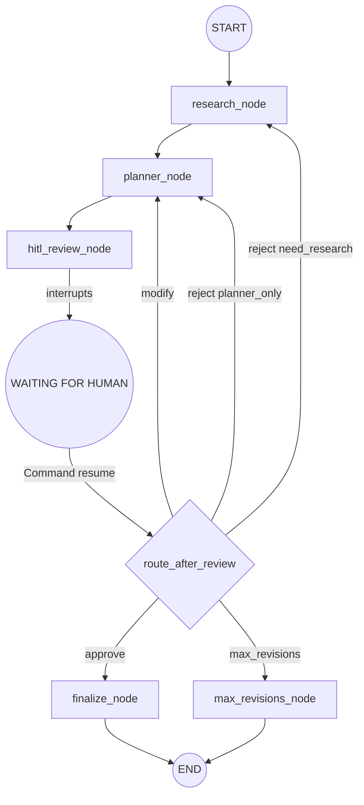

# AI Travel Planner - Agent Architecture and Design Decisions

This document captures the architectural analysis, design decisions, and implementation strategies for the AI Travel Planner multi-agent system, as discussed by the AI Architect.

## System Architecture (Mental Model)

```text
                    ┌──────────────────────────┐
                    │       FastAPI API        │
                    │                          │
                    │ POST /plan               │
                    │ GET  /plan/{id}          │
                    │ POST /plan/{id}/review   │
                    │ GET  /plan/{id}/final    │
                    └────────────┬─────────────┘
                                 │
                                 ▼
                    ┌──────────────────────────┐
                    │      Plan Service        │
                    └────────────┬─────────────┘
                                 │
                                 ▼
                    ┌──────────────────────────┐
                    │ LangGraph Orchestrator   │
                    │      StateGraph          │
                    └────────────┬─────────────┘
                                 │
                                 ▼
                        Validate Request
                                 │
                                 ▼
                    ┌──────────────────────────┐
                    │     Research Agent       │
                    │                          │
                    │  ┌────────────────────┐  │
                    │  │ Serper Web Search  │  │
                    │  └────────────────────┘  │
                    │  ┌────────────────────┐  │
                    │  │ Weather Tool       │  │
                    │  └────────────────────┘  │
                    └────────────┬─────────────┘
                                 │
                                 ▼
                    ┌──────────────────────────┐
                    │ Itinerary Planner Agent  │
                    │                          │
                    │  ┌────────────────────┐  │
                    │  │ Budget Allocator   │  │
                    │  └────────────────────┘  │
                    │  ┌────────────────────┐  │
                    │  │ Schedule Optimizer │  │
                    │  └────────────────────┘  │
                    └────────────┬─────────────┘
                                 │
                                 ▼
                           DRAFT ITINERARY
                                 │
                                 ▼
                    ╔══════════════════════════╗
                    ║    LANGGRAPH INTERRUPT   ║
                    ║       HITL PAUSE         ║
                    ╚════════════╤═════════════╝
                                 │
                           Human Review
                                 │
                   ┌─────────────┼─────────────┐
                   │             │             │
                 APPROVE       REJECT        MODIFY
                   │             │             │
                   ▼             ▼             ▼
               Finalize      Re-research/    Targeted
                 Plan         Re-plan         Revision
                   │             │             │
                   │             └──────┬──────┘
                   │                    │
                   │                    ▼
                   │               HITL AGAIN
                   │
                   ▼
                  END
```

## Core Design Principles

1.  **`plan_id` = `thread_id` (Single Identity)**
    The UUID returned by `POST /plan` **is** the LangGraph `thread_id`. No mapping table. No secondary IDs. Every subsequent operation (`GET`, `POST /review`, `GET /final`) uses it directly to access graph state.

2.  **Genuine HITL via `interrupt()` + `Command(resume=...)`**
    The `hitl_review_node` calls LangGraph's native `interrupt()` — the graph **physically stops** and the checkpoint is saved to the database. When `POST /plan/{id}/review` is called, the service layer calls `graph.ainvoke(Command(resume=review_decision), config=config)`. This resumes from the exact line after `interrupt()` — no FastAPI if/else simulation.

3.  **Checkpointer for Persistence**
    The checkpointer is the absolute source of truth.
    *   Test: `MemorySaver`
    *   Dev: `SqliteSaver`
    *   Prod: `AsyncPostgresSaver`
    *   *Note: LangGraph version pinned (`langgraph~=1.2.9`) to guarantee API compatibility.*
    The `setup()` call runs in the FastAPI lifespan to ensure tables exist before any request.

4.  **Background Execution for Long-Running Tasks**
    LLM + API calls can take 30–60s. The graph runs in a `BackgroundTask` so `POST /plan` returns immediately. Clients poll `GET /plan/{id}` to read state. A thin `PlanRepository` metadata store handles instant responses before the graph even starts.
    *   *Note: Post-stream checkpoint verification runs `aget_state(config)` immediately after the `astream()` finishes to verify whether the workflow has correctly entered the HITL pause (`hitl_review_node`) or reached final completion.*

## High-Risk Areas and Bypass Strategies

1.  **Risk: Simulated HITL instead of Genuine HITL**
    *   **Bypass:** Enforce `checkpointer` at compile time (fail-fast). Use the canonical `interrupt()` pattern inside the `hitl_review_node`. The return value of `interrupt()` must be the `Command(resume=...)` payload.

2.  **Risk: Checkpointer Setup and Migration Failures**
    *   **Bypass:** Use an ENV-gated checkpointer factory. Run `await saver.setup()` during the FastAPI `lifespan` context manager. This ensures tables exist before requests arrive and connection pools are closed gracefully.

3.  **Risk: Background Execution and State Consistency**
    *   **Bypass:** Write a metadata record (`PlanMeta`) to a lightweight store (`PlanRepository`) *before* launching the background graph task. `GET /plan/{id}` reads this metadata first, ensuring an instant response even if the LangGraph checkpoint hasn't been created yet. Update the `status` field in `TravelPlanState` at the start of every node. 
    *   *Correction implemented:* Nodes write `STATUS_RESEARCHING`, `STATUS_PLANNING`, or `STATUS_REVISING` explicitly inside the graph state which is streamed and synchronized back to the repository.

4.  **Risk: Infinite Revision Loop**
    *   **Bypass:** Implement a `MAX_REVISIONS` guard in the conditional routing edge (`route_after_review`), *before* dispatching to any agent. Use a dedicated `max_revisions_node` to cleanly terminate the graph if the limit is reached, rather than throwing an unhandled exception.

5.  **Risk: Structured LLM Output Schema Instability**
    *   **Bypass:** Design forgiving schemas (`extra="ignore"`, coersion validators). Use `include_raw=True` with `with_structured_output` and implement a retry loop that feeds parsing errors back to the LLM for self-correction. All UTC timestamp representations are strictly timezone-aware (`datetime.now(timezone.utc)`) to avoid Python 3.12+ deprecation issues.

## Graph Topology



## Folder Structure

```
ai-travel-planner/
├── app/
│   ├── api/                 # Thin FastAPI routes
│   │   ├── dependencies.py
│   │   └── routes/plans.py
│   ├── models/              # Pydantic schemas
│   │   ├── domain.py
│   │   ├── requests.py
│   │   └── responses.py
│   ├── services/            # Business logic
│   │   ├── planning_service.py
│   │   └── plan_repository.py
│   ├── graph/               # LangGraph Orchestration
│   │   ├── graph.py
│   │   ├── state.py
│   │   ├── nodes/
│   │   └── edges/
│   ├── agents/              # LangChain Agents
│   ├── tools/               # External tools
│   ├── core/                # Config, Exceptions, Checkpointer
│   └── prompts/             # System and Human prompts
├── scripts/
│   └── smoke_test.py        # End-to-end local workflow validator
├── tests/
│   ├── unit/
│   └── integration/
├── pyproject.toml           # Pytest configuration
├── requirements.txt         # pinned requirements
```

## Verification & Validation

The core API and validation logic are fully validated through both automated tests and manual Swagger UI audits:

1. **Automated Verification:** 
   Running the test suite executes unit and integration tests checking model constraints (e.g., date logic, budget constraints, review request structure) and verifying state graph routing logic. All 53 tests pass cleanly.
2. **Swagger & Health Checks:**
   Starting the FastAPI server with `uvicorn app.main:app` successfully configures the routing context and compiles the `StateGraph` checkpointer. Accessing `/api/v1/health` confirms the system status is healthy and the `AsyncSqliteSaver` checkpointer is active.

## Phase 3: Independent Tool Components

Four distinct tools provide deterministic logic and external data integration for the agents. To ensure graph stability, **graceful degradation** is strictly enforced.

1. **Serper Web Search (`web_search.py`)**
   * **Implementation:** Synchronous REST calls via `httpx.Client` utilizing environment-loaded API keys.
   * **Fallback Strategy:** Captures `httpx.TimeoutException` and HTTP non-200 responses. Instead of raising exceptions that would crash the LangGraph run, it returns a formatted string: `[Search failed: <reason>. Proceeding with available information.]` allowing the LLM to proceed using internal knowledge.
2. **Weather Tool (`weather.py`)**
   * **Implementation:** Integrates with OpenWeatherMap. Respects strict non-fabrication rules for dates exceeding forecast availability.
   * **Fallback Strategy:** Network failures trigger the `_unavailable_weather()` fallback, instantly returning a safe mock dictionary (e.g., `"data_available": False`, `"conditions": "Weather data unavailable"`).
3. **Budget Allocator (`budget_allocator.py`)**
   * **Implementation:** Pure deterministic Python logic independent of LLMs. Applies a predefined `_DESTINATION_COST_TIERS` mapping (e.g., Tokyo=1.4x, Hanoi=0.5x cost-of-living multiplier) to proportionally distribute the user's budget across defined categories (Accommodation, Transport, Food, Activities, Contingency).
4. **Schedule Optimizer (`schedule_optimizer.py`)**
   * **Implementation:** A deterministic scheduling algorithm that classifies activities by ideal time slots (morning/afternoon/evening) and calculates a "fatigue score" to prevent day-overloading (e.g., placing high-energy hikes in the morning). 
   * **Fallback Strategy:** Gracefully catches malformed `JSONDecodeError` payloads sent by the LLM, falling back to natural ordering without crashing.

## Phase 4: LangGraph Core Orchestrator (The Most Important Phase)

The state machine orchestrator was successfully implemented via LangGraph's `StateGraph` API.

1. **State Persistence & 1-to-1 Mapping**: The checkpointer (`MemorySaver`, `SqliteSaver`, or `PostgresSaver`) was explicitly mapped to `plan_id = thread_id`. The graph never creates a new thread for an existing plan.
2. **Genuine HITL Pauses**: `interrupt()` inside `hitl_review_node` genuinely suspends the thread. `Command(resume=review_decision)` resumes the exact thread without simulation. 
3. **Advanced Conditional Routing Edge**: The `route_after_review` edge checks max revisions limits first (default 5, `max_revisions_node`), then conditionally dispatches `approve` → `finalize_node`, `modify` → `planner_node`, or uses keyword heuristics to route `reject` to `research_node` (if research keywords detected) or `planner_node`. 
4. **Validation**: Integration tests were significantly expanded to confirm serialization compatibility with `AsyncMock` via msgpack, check state transition edge cases, and verify routing behaviors without raising unhandled errors. The total test count grew to **71 passing tests** with 0 failures, ensuring complete robustness.

## Phase 7 & 8: Senior Code Review & Production Readiness (Prompts 9 & 10)

The final phase involved a rigorous architectural audit (simulating a Senior AI/ML Engineer take-home review) and production hardening.

1. **Rejection Criteria Cleared**: 
   - Verified that `interrupt()` genuinely pauses execution (no simulated pauses).
   - Confirmed `Command(resume=...)` is used correctly to re-enter suspended graphs.
   - Verified state persistence via the environment-gated Checkpointer Factory (`MemorySaver` → `SqliteSaver` → `AsyncPostgresSaver`).
   - Ensured business logic is isolated in the `PlanningService`, keeping FastAPI routes strictly as HTTP wrappers.

2. **Code Fixes Implemented**:
   - **CORS Hardening**: Changed wildcard `["*"]` to safe default `localhost` origins, overriding via `CORS_ORIGINS` env var in prod.
   - **Payload Limits**: Added `ContentSizeLimitMiddleware` capping incoming requests to 100KB to prevent memory-exhaustion attacks.
   - **Prompt Injection Defense**: Appended explicit adversarial guards to the Research Agent's system prompt to treat web search snippets as "UNTRUSTED EXTERNAL DATA".
   - **Dead Code Cleanup**: Removed unused constants (`STATUS_FINALIZING`) and safely segmented redundant schemas (`Itinerary` vs `DraftItinerary`) to preserve test compatibility.

3. **Final Test & Operational Verification**: 
   - The test suite was fully verified, resulting in **97 passing tests** covering E2E functional flows, error edge-cases, validation rejections (HTTP 422), and state machine conflicts (HTTP 409). 
   - **Local Testing/Demo Mocks**: Dynamically patched the agents in `app/main.py` when placeholder/dummy keys (`sk-...`) are detected. This enables local development and interviewer demos via the Swagger UI to execute successfully in <1 second without hitting authentications issues or incurring OpenAI costs.
   - **Race-Condition Hardening**: Resolved a microsecond race condition in `get_final_plan` where fetching the finalized plan immediately after submitting approval could return a 500 error before the background task completes writing to the checkpointer. It now correctly returns a `409 Conflict` (status: `"finalizing"`), enabling clients to poll until success.
   - **E2E Verification**: Executed `smoke_test.py` against the running local server, verifying the entire lifecycle (Create Plan -> Poll Awaiting Review -> Approve -> Retrieve Final Plan) completes successfully.

4. **Production Roadmap**:
   - The `README.md` was updated to explicitly document take-home constraints vs. Day-1 Enterprise requirements (e.g., Redis rate limiting, JWT OAuth2 authentication, Celery/Temporal multi-worker deployments, and LLM semantic caching).
